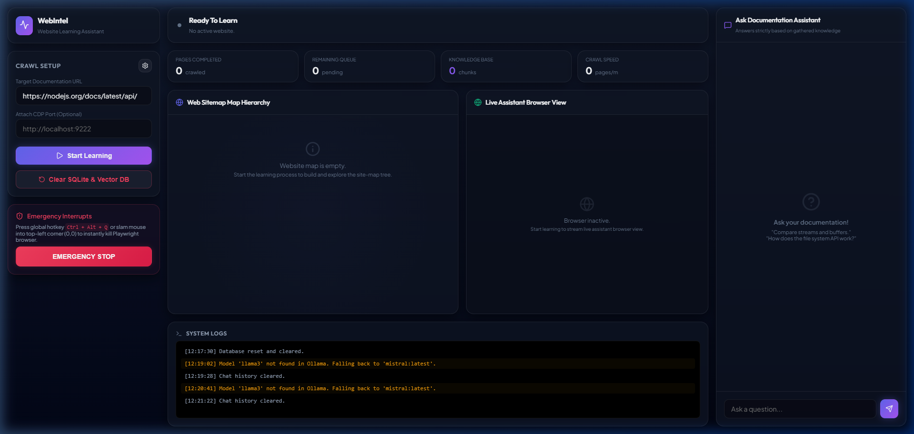
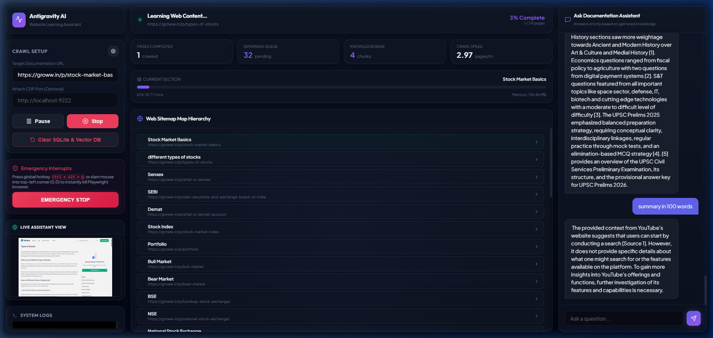

# WebIntel 🌐

> **AI Website Learning Assistant & RAG Chat Cockpit** — 100% local, offline, and secure.

WebIntel is a desktop assistant that takes control of your browser to autonomously explore websites, digest documentation, and build a searchable vector database. Once crawled, you can query your local knowledge base using a Retrieval-Augmented Generation (RAG) chat panel running entirely offline on your computer.

No API keys, cloud models, or trackers required. WebIntel connects directly to your local **Ollama** instance.

---

## 📸 Media Showcase

### 1. Rebranded WebIntel Cockpit Layout
A fluid, slate-dark dashboard displaying real-time scraping stats, visual sitemaps, system log consoles, and a local RAG Chat window:


### 2. Live Scraper & Sitemap Ingestion
Watch the assistant explore and map pages side-by-side in high-fidelity while logs stream into the console below:


### 3. Demo Video
A demo showing settings configuration, local tags parsing, crawl lockdowns, and query completions:


---

## 🛠️ Key Features

* **Pure Local AI (Ollama)**: Automatically detects models installed in your local Ollama directory. No API key needed.
* **Ollama Fallbacks & Matching**: Matches name prefixes (like `llama3` to `llama3:latest`) and automatically falls back to installed models if configured tags are missing, avoiding 404 tag errors.
* **Path Prefix Lockdowns**: Automatically restricts crawls to the starting URL's directory (e.g. `/p/` on `groww.in`), preventing the crawler from wandering onto homepages or unrelated subdirectories.
* **Emergency Fail-Safes**: Instantly kills Playwright's Chromium instance using a global hotkey (`Ctrl + Alt + Q`) or by slamming your mouse into the top-left corner (0,0).
* **Developer Console Logs**: Full-width logs terminal positioned at the bottom of the dashboard providing step-by-step transparency.
* **Interactive Sitemap**: Recreates the folder hierarchy of crawled pages with color-coded status badges (`crawled`, `crawling`, `discovered`).

---

## 🏗️ Architecture

* **Backend**: FastAPI (Python 3), Playwright (browser automation), BeautifulSoup (elements extractor), SQLite (metadata & chat history), ChromaDB (local vector store).
* **Frontend**: React, TypeScript, Vite, Vanilla CSS.

---

## 🚀 Quick Start

### Prerequisites
1. Install [Ollama](https://ollama.com/) on your machine.
2. Pull an LLM (e.g., `llama3` or `mistral`) and an embedding model (e.g., `nomic-embed-text`):
   ```bash
   ollama pull mistral:latest
   ollama pull nomic-embed-text:latest
   ```

### 1. Run the Python Backend
1. Create a Python virtual environment and activate it:
   ```bash
   python -m venv .venv
   # Windows:
   .venv\Scripts\activate
   # macOS/Linux:
   source .venv/bin/activate
   ```
2. Install python dependencies:
   ```bash
   pip install -r requirements.txt
   playwright install
   ```
3. Run the application:
   ```bash
   python backend/main.py
   ```

### 2. Build the Frontend Assets (Optional)
If you modify frontend files, you can rebuild them:
1. Navigate to the frontend directory:
   ```bash
   cd frontend
   npm install
   npm run build
   ```
2. The FastAPI backend will automatically serve the built static assets from `frontend/dist`.
